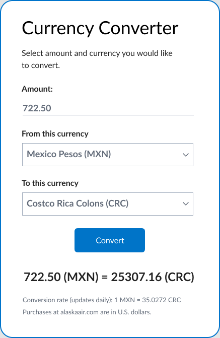

# Currency Converter
Your team has been tasked with building a currency converter to go in the footer of alaskaair.com, it will use the user's geolocation to pre-determine the currency that the converter will convert from. Here's an initial design given to you by the team's designer:



Someone on your team has already started this work, but they went on vacation so you agreed to finish it up.
## Currency Converter API
The first part of this task, the "Currency Converter" API, has already been implemented. It can convert an arbitrary amount of currency from one type to another. The conversion rates for the supported currencies are retrieved from the file `server/utils/conversionRates.js`.

The endpoint has the structure of:

`http://localhost:3001/api/currencyConverter?from=[fromCurrencyType]&to=[toCurrencyType]&amount=[amount]`

So for example if we hit, `api/currencyConverter?from=MXN&to=CAD&amount=10` the response would be the value of 10 Mexico Pesos in Canadian Dollars.

This api is implemented in `server/app.js` using `Express.js`. Your task is to add any error handling to this API that you think would be useful. **Do NOT modify server/server.js, your routes should solely live in server/app.js. This is to ensure the server unit tests run properly.**

## Get Local Currency Type API
The next part has not been implemented. We will need a "Get Local Currency" API that uses the user's location and returns the local currency in the user's location. Before going on vacation, your fellow developer had researched some ways to approach getting the user's location in order to build this API, feel free to use any of these methods or implement your own:
1. Use the user's IP address and the third-party API [ipapi](https://ipapi.co/api/#specific-location-field).
2. Use the user's IP address and a database such as [IP2Location](https://lite.ip2location.com/ip2location-lite) to retrieve the user's location.
3. Use the built-in [HTML geolocator API](https://www.w3schools.com/html/html5_geolocation.asp) to get the latitude and longitude of a user in the front end and then use [Google's reverse geocoding API](https://developers.google.com/maps/documentation/geocoding/overview#ReverseGeocoding) to get the user's location.

We should be able to test this by hitting the endpoint:

```http://localhost:3001/api/locationToCurrency```

So for example, if a user in Mexico hits `api/locationToCurrency`, we should expect the response to be `MXN`.

There's a skeleton of this endpoint in `server/app.js` using `Express.js`.
## API Unit Tests
The next part of this will be to test your APIs to make sure they work as expected. The unit testing file is in `server/app.test.js` which uses `Jest` and `Supertest`. There are a few unit tests in there but not enough to cover all cases.

Please add as many tests as you deem necessary.

## Front End
The final part will be to complete the `React` front end inside `client/src/` which will use the APIs from earlier. The barebones components and the functionality to convert from one currency to another using the "Currency Converter" API are there. We still need to connect it to the "Get Local Currency Type" API, add in error handling and some styling, and whatever else you deem necessary.

There are a couple technical requirements that are required for the front end:
1. It must use the "Get Local Currency Type" API to get the user's local currency. If it's a currency that we support, it must pre-populate the `fromCurrency` type. If we do not support that currency, then the default is USD.
2. It must use the "Currency Converter" API to convert the currency (already implemented).

You can use the design given by the team's designer at the beginning of this README as a reference, but feel free to implement whatever design you like.

We do, however, highly encourage you to use our custom Auro Design System to get any components or colors you may want to use: https://auro.alaskaair.com/getting-started/developers/common-definitions.

## Front-End Unit Tests
The next part of your challenge will be to test the front end to make sure it works as expected. Some unit tests have already been added in `client/src/App.test.js` using `Jest`, but it might not cover all the cases needed.

Please add as many tests as you deem necessary.
## What We're Looking For

- How efficient is the implementation?
- How is the implementation organized?
- How well is the code tested?
- How accessible is the front end?

Please remember to send over your solution at least a couple hours before the start of your interview!

## How to use the starter code
### Before developing
- `npm install` - Installs the necessary node modules for your client and server, make sure to do this in the project root
### Running the app
- `npm run dev` - Runs both the client and the server at the same time (might take a minute to run, client should open in a browser automatically)
- `npm run client` - Runs the client
- `npm run server` - Runs the server
### Testing the app
- `npm run test` - Runs all unit tests
- `npm run test-client` - Runs all client tests
- `npm run test-server` - Runs all server tests

Feel free to change the folder structure any way you deem necessary, but be aware it might break the commands described above.
